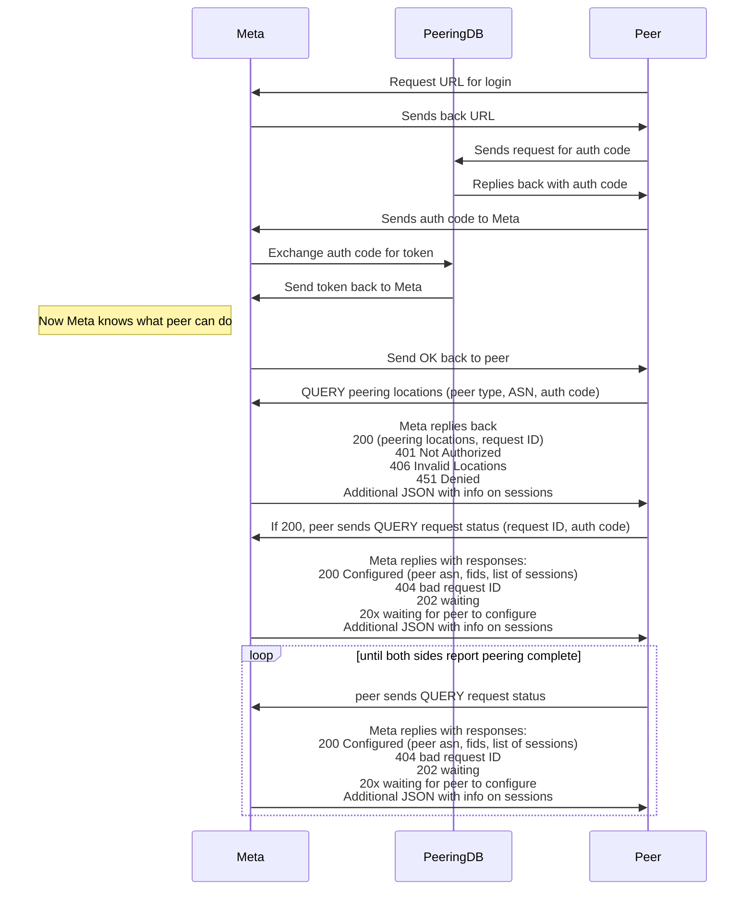

# Automated Peering API

Initial proof of concept for Automated Peering API

See [CONTRIBUTING.md](CONTRIBUTING.md)

## License

By contributing to this repo, you agree that your contributions will be
licensed under the LICENSE file in the root directory of this source tree.

Documentation is covered by the Creative Commons Attribution 4.0 (CC-BY-4.0)
license.
